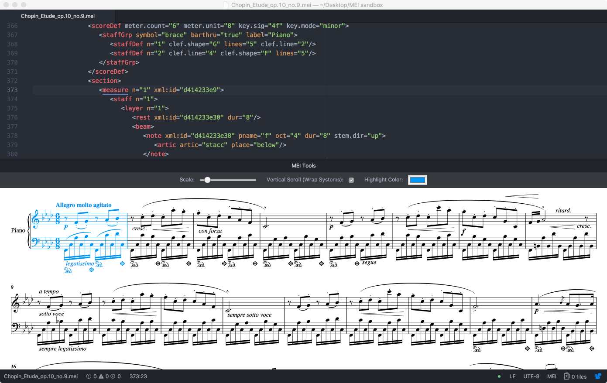
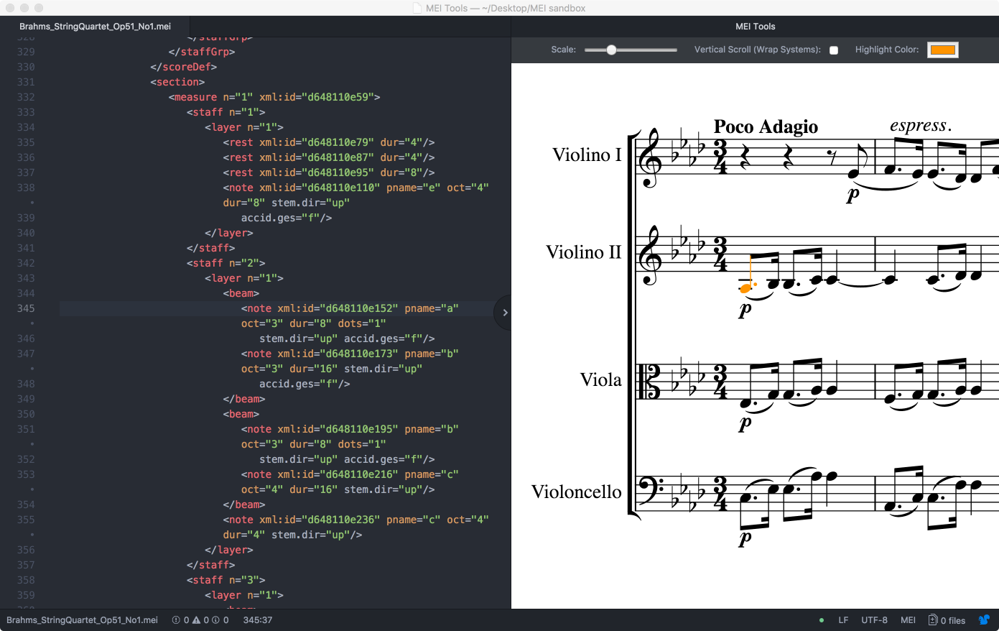

# mei-tools-atom

[MEI](http://music-encoding.org/) is an open-source XML-based system for the semantic encoding of music documents. This package, for use with the open-source [Atom text editor](https://atom.io/), provides on-the-fly rendering of MEI into music notation with _[Verovio](http://www.verovio.org/)_.

__This package is currently under development__ and there are known performance issues with large files.  Contributions are welcome.

## Current Features

- as-you-type rendering into music notation with _[Verovio](http://www.verovio.org/)_
- scale notation (zoom in or out) for ease of viewing
- flow measures horizontally or wrap systems for vertical flow (scroll through music horizontally or vertically)
- element under cursor in MEI code is highlighted in notation
    - this feature works by matching `xml:id`s, so if you have no `xml:id`s on your elements you will have no highlighting in your notation
    - if the current element has no `xml:id`, the parent `<staff>` and then `<measure>` will be checked and highlighted if an `xml:id` is found
- choose color for highlighting
- click on a note or other rendered notation element to take the cursor to the associated place in the MEI code
    - also relies on `xml:id`s, so elements without `xml:id`s do not provide this feature

## Planned Features
- create option to automatically generate `xml:id`s
- address performance issues with large documents
- integrate validation and other XML helper tools?

## Dependencies
This package requires [atom-language-mei](https://github.com/nCoda/atom-language-mei), which will be installed automatically when this package is installed.

## Validating your MEI
Only valid MEI can be rendered into notation with _[Verovio](http://www.verovio.org/)_. To ensure your MEI is valid, an XML validation tool is recommended.  [linter-autocomplete-jing](https://github.com/aerhard/linter-autocomplete-jing) was apparently designed for use with TEI and MEI, so I recommend starting there.  Please note that [linter-autocomplete-jing](https://github.com/aerhard/linter-autocomplete-jing) requires Java Runtime Environment (JRE) v1.6 or above.  Follow the link to the package repository for details.

## Gratitude
Thanks to Laurent Pugin and the MEI community for [all their work on _Verovio_](https://github.com/rism-ch/verovio).  Thanks also to Laurent for making _Verovio_ available to me as a Node package.
