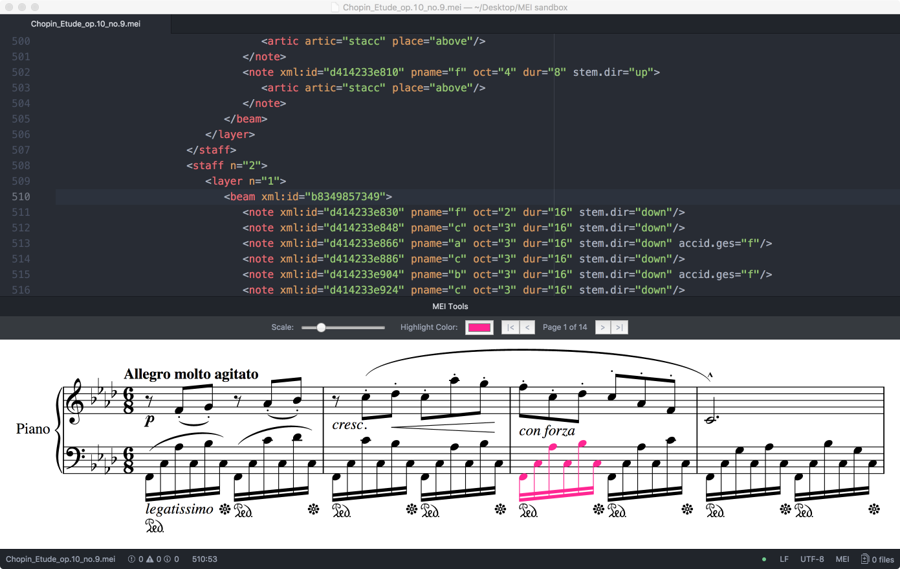
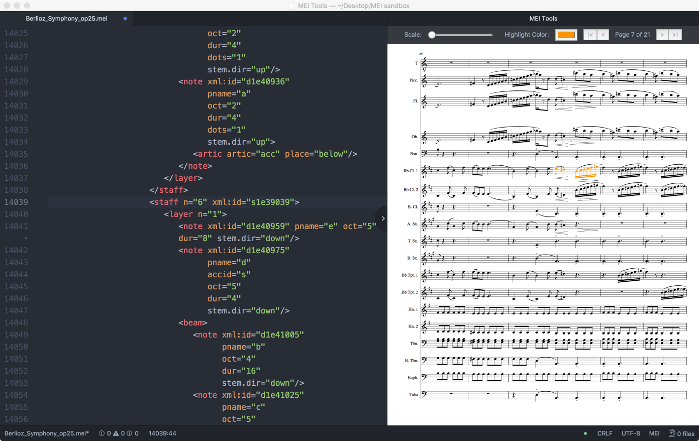
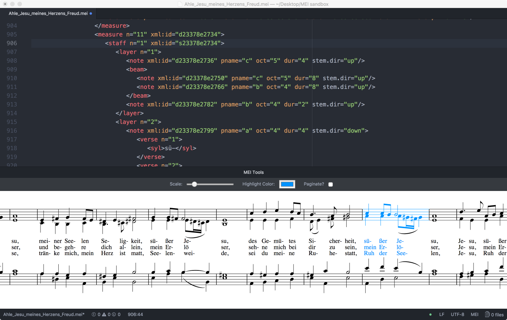

# mei-tools-atom

For use with the open-source text editor [_Atom_](https://atom.io/), this package provides on-the-fly rendering of [MEI](http://music-encoding.org/) into music notation with _[Verovio](http://www.verovio.org/)_. It was created with the support of the [nCoda](https://ncodamusic.org/) team, who will also provide ongoing development and maintenance.

__This package is currently under development__ and there are known performance issues with large files.  Contributions are welcome.

## Screenshots

## Current Features

- As-you-type rendering of MEI into music notation with _[Verovio](http://www.verovio.org/)_
- Scale notation (zoom in or out) for ease of viewing
- Pagination allows larger files to be rendered into notation with better performance
- Flow measures horizontally for smaller files
- Element under cursor in MEI code is highlighted in notation
    - this feature works by matching `xml:id`s, so if you have no `xml:id`s on your elements you will have no highlighting in your notation
    - if the current element has no `xml:id`, the parent `<staff>` and then `<measure>` will be checked for an `xml:id` and will be highlighted if one is found
- Choose color for highlighting
- Click on a note or other rendered notation element to take the cursor to the associated place in the MEI code
    - also relies on `xml:id`s, so elements without `xml:id`s do not provide this feature

## Planned Features
- Create function to automatically generate `xml:id`s
- Address remaining performance issues with large documents
- Integrate validation and autocomplete?
- Integrate other XML helper tools and style sheets?

## Installation
This package is [published to the official Atom registry](https://atom.io/packages/mei-tools-atom)
and can be installed by following their [general instructions](https://flight-manual.atom.io/using-atom/sections/atom-packages/).
If prompted to install dependencies, click 'yes' and allow installation to complete.

Once installed, use the package by following these steps:
1. Launch Atom and open an MEI file (menu item File > Open...).
    - [this is a nice example encoding](https://raw.githubusercontent.com/music-encoding/sample-encodings/master/MEI_3.0/Music/Complete_examples/Chopin_Etude_op.10_no.9.mei) - save with the `.mei` extension (delete anything after `.mei`)
    - [more examples of MEI 3.0 encodings can be found here](https://github.com/music-encoding/sample-encodings/tree/master/MEI_3.0/Music/Complete_examples)
1. To display the notation, use the menu item Packages > MEI Tools > Show/Hide Notation, or simply press `Ctrl Option Cmd M`.

## Dependencies
This package requires [atom-language-mei](https://github.com/nCoda/atom-language-mei), which will be installed automatically when this package is installed.

## Validating your MEI
Only valid MEI can be rendered into notation with _[Verovio](http://www.verovio.org/)_. To ensure your MEI is valid, an XML validation package is recommended.  [linter-autocomplete-jing](https://github.com/aerhard/linter-autocomplete-jing) was designed for use with TEI and MEI, so I recommend starting there.  Please note that [linter-autocomplete-jing](https://github.com/aerhard/linter-autocomplete-jing) requires Java Runtime Environment (JRE) v1.6 or above.  [Visit the package repository](https://github.com/aerhard/linter-autocomplete-jing) for details.

## Gratitude
Thanks to Laurent Pugin and the MEI community for [all their work on _Verovio_](https://github.com/rism-ch/verovio).  Thanks also to Laurent for making _Verovio_ available to me as a Node package. Thanks to the [nCoda](https://ncodamusic.org/) team for the financial support that started this project and for their ongoing contributions.
